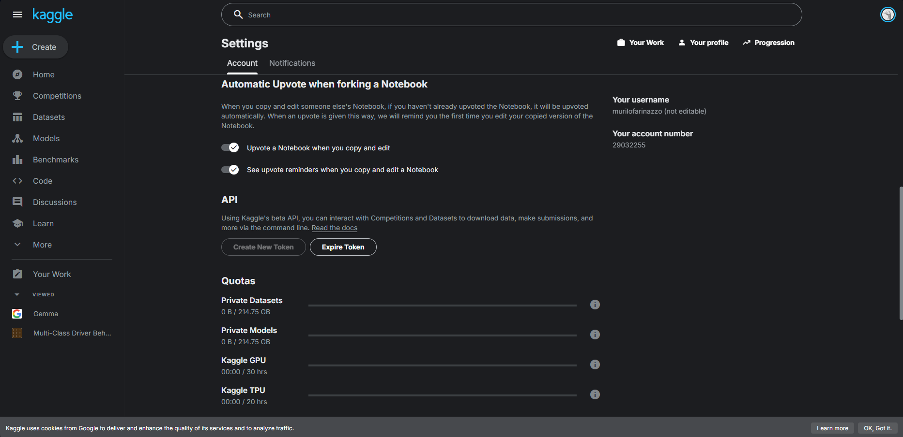

# Automação Dataset de Direção

Com estes scripts, automatizamos quase todo o fluxo de dados para construir um banco unificado e normalizado de comportamentos de direção (múltiplos datasets do Kaggle), pronto para treino!

## Índice

- [Sobre](#sobre)
- [Demonstração](#demonstração)
- [Instalação](#instalação)
- [Uso](#uso)
- [Explicação dos Arquivos](#explicação-dos-arquivos)

## Sobre

O projeto é todo em Python, com os códigos em `src/`. É uma cadeia de scripts — se faltar um, a automação não conclui. O fluxo completo é:

1) Download dos 5 datasets (Kaggle) para `raw/1`..`raw/5`.
2) Ingestão para `data/processed/{train,valid,test}/{Class}` com mapeamentos consistentes e split 70/15/15 quando aplicável (respeitando splits fornecidos no raw/5).
3) Verificação dos totais esperados vs. atuais.
4) Padronização das imagens (tamanho e formato) em `data/standardized`.

## Demonstração

O arquivo `run_pipeline.py` é o pai da cadeia. Ele baixa, ingere, verifica e padroniza com um único comando:

```
python .\src\run_pipeline.py --download-mode api --rebuild --seed 42 --std-size 224 --std-mode fit --std-convert jpg
```

Opções:
- `--download-mode api|cli`: API mostra barra de progresso; CLI faz streaming no terminal.
- `--rebuild`: apaga `data/processed` e `data/standardized` antes de ingerir.
- `--skip-download`: pula o download (caso `raw/` já esteja populado).

## Instalação

Pré‑requisitos:
- Python 3.10+
- Pacotes: `kaggle`, `Pillow`

Instalação (exemplo):

```
pip install kaggle Pillow
```

Credenciais do Kaggle:
- Template em `./.kaggle/kaggle.json`:

```
{
  "username": "YOUR_KAGGLE_USERNAME",
  "key": "YOUR_KAGGLE_API_KEY"
}
```

Como obter:
- Kaggle → Profile → Account → API → Create New Token (baixa o seu `kaggle.json`).
- Você pode sobrescrever `./.kaggle/kaggle.json` com o arquivo baixado ou colar os valores no template.

Onde pegar (screenshot):



Permissões: garanta que o arquivo é legível pelo seu usuário.

Configuração dos datasets:
- Edite `kaggle_datasets.json` para habilitar/desabilitar itens e ajustar os destinos. O padrão já mapeia os 5 datasets para `raw/1`..`raw/5`.

## Uso

Download (somente):

```
python .\src\download_kaggle_datasets.py --apply --mode api
```

Ingestão (por dataset):

```
python .\src\ingest_raw1_to_processed.py --seed 42
python .\src\ingest_raw2_to_processed.py --seed 42
python .\src\ingest_raw3_to_processed.py --seed 42
python .\src\ingest_raw4_to_processed.py --seed 42
python .\src\ingest_raw5_to_processed.py
```

Verificação:

```
python .\src\verify_processed_totals.py
```

Padronização (ex.: 224, fit, jpg):

```
python .\src\standardize_dataset.py --size 224 --mode fit --convert jpg
```

Pipeline completo:

```
python .\src\run_pipeline.py --download-mode api --rebuild --seed 42 --std-size 224 --std-mode fit --std-convert jpg
```

Observações:
- Alguns datasets exigem aceitar termos no site do Kaggle antes do download.
- Downloads grandes podem demorar; se interromper, reexecute (o script força/retoma operações).
- Execute os comandos a partir da raiz do projeto (PowerShell no Windows).


## Scripts de Modelagem e Treinamento

Além do pipeline de dados, o projeto inclui scripts para amostragem e treinamento de modelos de classificação com YOLOv8:

### `src/modeling/create_sample.py`
Gera um subconjunto amostral dos dados padronizados para experimentação rápida ou debug. Exemplo:

```bash
python src/modeling/create_sample.py --src data/standardized --dst data/sample --n 50
```
Cria até 50 imagens por classe em cada split (train/val/test) em `data/sample/`.

### `src/modeling/train_yolo.py`
Treina um classificador YOLOv8 (Ultralytics) usando os dados amostrados ou completos. Exemplo:

```bash
python src/modeling/train_yolo.py --data data/sample --epochs 3 --imgsz 224 --batch 8 --project outputs/training_logs
```
Parâmetros:
- `--data`: caminho para os dados (ex: `data/sample` ou `data/standardized`)
- `--epochs`: número de épocas
- `--imgsz`: tamanho das imagens (ex: 224)
- `--batch`: tamanho do batch
- `--project`: pasta de saída dos logs/resultados
- `--device`: cpu, mps ou cuda (opcional)

Os resultados do treinamento ficam em `outputs/training_logs/yolo_driver_drowsiness/`.

---

## Explicação dos Arquivos

Explicação de cada arquivo em `src/` (ordem lógica):

| Arquivo | Descrição |
|---------|-----------|
| `run_pipeline.py` | Orquestra toda a cadeia: download → ingestors (raw1..5) → verify → standardize. Aceita flags de rebuild/seed/tamanho. |
| `download_kaggle_datasets.py` | Baixa conforme `kaggle_datasets.json` para `raw/1`..`raw/5`. `--mode api` mostra progresso, `--mode cli` faz streaming. Usa `./.kaggle/kaggle.json`. |
| `ingest_raw1_to_processed.py` | Raw/1: `safe_driving`,`turning` → `SafeDriving`; `talking_phone`,`texting_phone` → `DangerousDriving`; split 70/15/15. |
| `ingest_raw2_to_processed.py` | Raw/2: mapeia `c0..c9` para 4 classes globais e aplica 70/15/15 por classe. |
| `ingest_raw3_to_processed.py` | Raw/3: `Active Subjects` → `SafeDriving`; `Fatigue Subjects` → `SleepyDriving`; split 70/15/15. |
| `ingest_raw4_to_processed.py` | Raw/4: `alert` → `SafeDriving`; `yawning`/`microsleep` → `SleepyDriving`; split 70/15/15. |
| `ingest_raw5_to_processed.py` | Raw/5: respeita splits do dataset; mapeia IDs 0..5 para 5 classes globais. |
| `verify_processed_totals.py` | Compara `data/processed` aos totais esperados dos raws 1..5 e exibe os deltas. |
| `standardize_dataset.py` | Padroniza imagens (tamanho e formato) para `data/standardized`. |
| `cleanup_processed.py` | Limpa `data/processed` por manifestos ou por raw-id (match por basename); útil para refazer ingestões. |
| `verify_raw5_ingestion.py` | Verificador específico do raw/5 (manifest vs. anotações). |
| `__init__.py` | Pacote Python. |

#### Modelagem
| Arquivo | Descrição |
|---------|-----------|
| `modeling/create_sample.py` | Cria amostras pequenas dos dados padronizados para debug/teste rápido. |
| `modeling/train_yolo.py` | Treinamento de classificador YOLOv8 (Ultralytics) com os dados amostrados ou completos. |


Pastas de saída:
- `raw/` (downloads)
- `data/processed/{train,valid,test}/{Class}`
- `data/standardized/{train,valid,test}/{Class}`
- `data/sample/{train,val,test}/{Class}` (amostras)
- `outputs/training_logs/yolo_driver_drowsiness/` (resultados de treino)

# Estrutura de Dados e Labels (para a IA)

Nossa IA trabalha com 5 classes globais e um particionamento fixo em três etapas: treino (train), validação (valid) e teste (test). Após a ingestão e padronização, a estrutura de diretórios e as quantidades ficam assim:

Classes globais:
- SafeDriving: motorista atento/alerta
- DangerousDriving: ações perigosas (ex.: falar ao telefone, digitar)
- Distracted: distrações diversas (ex.: olhar para os lados, gestos)
- Object: objetos/itens (ex.: bebida, celular) — quando etiquetados como tal
- SleepyDriving: sonolência (yawn/microsleep)

Estrutura de pastas utilizada pelo treinamento:
- `data/processed/{train,valid,test}/{Class}` — dados brutos consolidados (formato original)
- `data/standardized/{train,valid,test}/{Class}` — dados padronizados (ex.: 224x224, modo fit, jpg)

Contagens por etapa (planejadas na padronização recente):

Train (treino):
- DangerousDriving: 10.897
- Distracted: 6.250
- Object: 1.614
- SafeDriving: 38.320
- SleepyDriving: 14.479
- Total (train): 71.560

Valid (validação):
- DangerousDriving: 2.146
- Distracted: 1.233
- Object: 329
- SafeDriving: 8.046
- SleepyDriving: 3.046
- Total (valid): 14.800

Test (teste):
- DangerousDriving: 1.836
- Distracted: 1.132
- Object: 296
- SafeDriving: 7.659
- SleepyDriving: 2.937
- Total (test): 13.860

Total geral (todas as etapas): 100.220

Observações importantes:
- As contagens acima refletem a última execução em dry‑run da padronização (224, fit, jpg) e podem variar ligeiramente caso os conjuntos de origem sejam atualizados, filtros mudem ou o split 70/15/15 seja refeito com outra semente.
- O mapeamento de classes vem dos scripts de ingestão:
  - raw/1: `safe_driving`,`turning` → SafeDriving; `talking_phone`,`texting_phone` → DangerousDriving
  - raw/2: `c0` → SafeDriving; `c1..c4` → DangerousDriving; `c5,c7,c8,c9` → Distracted; `c6` → Object
  - raw/3: `Active Subjects` → SafeDriving; `Fatigue Subjects` → SleepyDriving
  - raw/4: `alert` → SafeDriving; `yawning`/`microsleep` → SleepyDriving
  - raw/5: respeita os splits fornecidos pelo dataset, mapeando IDs 0..5 para as 5 classes globais


# Deep-Learning-para-visao-computacional-driver-drowsines-prediction-DDP-
Projeto de Deep Learning para detecção de sonolência em motoristas (Driver Drowsiness Prediction) em tempo real, utilizando Visão Computacional. Trabalho da disciplina de Redes Neurais e Aprendizado Profundo.

## 📊 Dataset

Este projeto utiliza uma combinação de conjuntos de dados públicos para treinar e validar o modelo. Conforme a **Tarefa 1** do projeto, os seguintes datasets foram selecionados e devem ser baixados antes da execução dos scripts.

| Nome do Conjunto de dados | Natureza | Tipo de Rótulos | Quantidade | Link para Download |
| :--- | :---: | :---: | :---: | :--- |
| Multi-Class Driver Behavior | Imagem | Classificação | 7276 | [Acessar no Kaggle](https://www.kaggle.com/datasets/arafatsahinafridi/multi-class-driver-behavior-image-dataset) |
| State Farm Distracted Driver Detection | Imagem | Classificação | 22400 | [Acessar no Kaggle](https://www.kaggle.com/datasets/rightway11/state-farm-distracted-driver-detection/) |
| Frame Level Driver Drowsiness Detection (FL3D) | Imagem | Detecção de Objetos e classificação | 53400 | [Acessar no Kaggle](https://www.kaggle.com/datasets/matjazmuc/frame-level-driver-drowsiness-detection-fl3d) |
| Drowsiness Prediction Dataset | Imagem | Classificação | 9120 | [Acessar no Kaggle](https://www.kaggle.com/datasets/rakibuleceruet/drowsiness-prediction-dataset) |
| Driver Inattention Detection Dataset | Imagem | Detecção de Objetos | 14900 | [Acessar no Kaggle](https://www.kaggle.com/datasets/zeyad1mashhour/driver-inattention-detection-dataset) |
